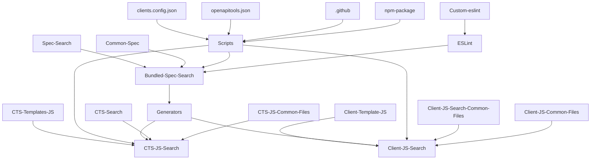

## Dependency of generated code

Here is a summary of what generated codes depends on, what needs to be checked for the cache.
Note that this is only the generating dependency graph, that mean if a parent has changed, the child must be generated again.

`yarn cli cts generate javascript <client>`

